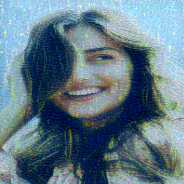
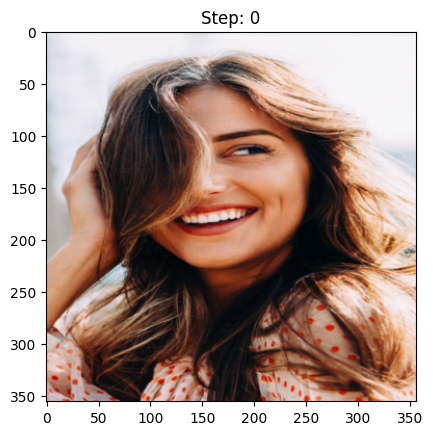
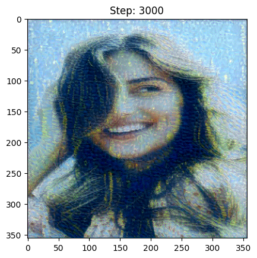

# Neural Style Transfer in PyTorch

This is a simple implementation of neural style transfer in PyTorch. The code is based on the implementaion by [Alaadin Persson](https://www.youtube.com/watch?v=imX4kSKDY7s).

## Image

## Style

## Generated

- Step: 200

    

- Step: 3000

    
